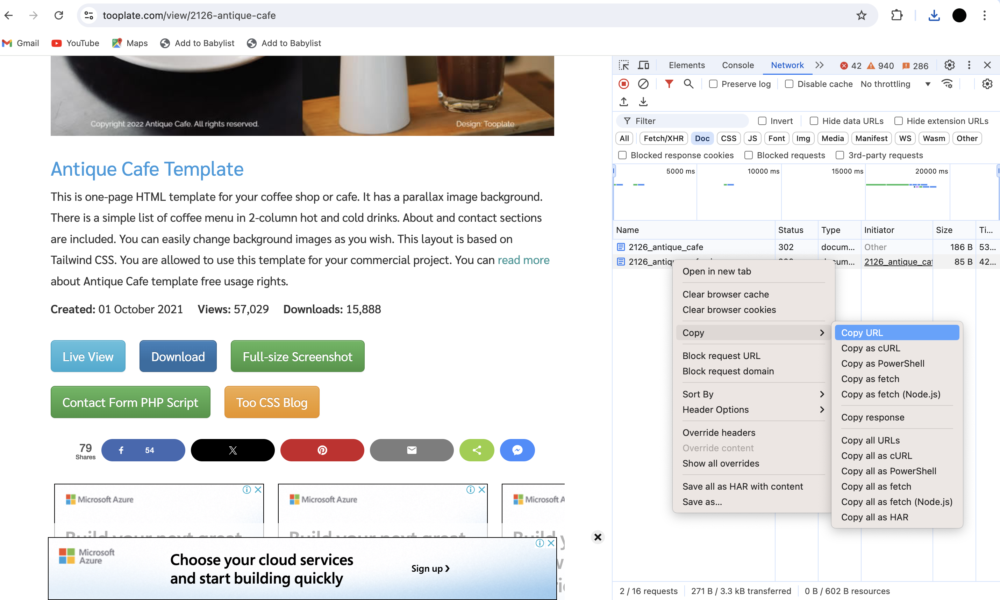
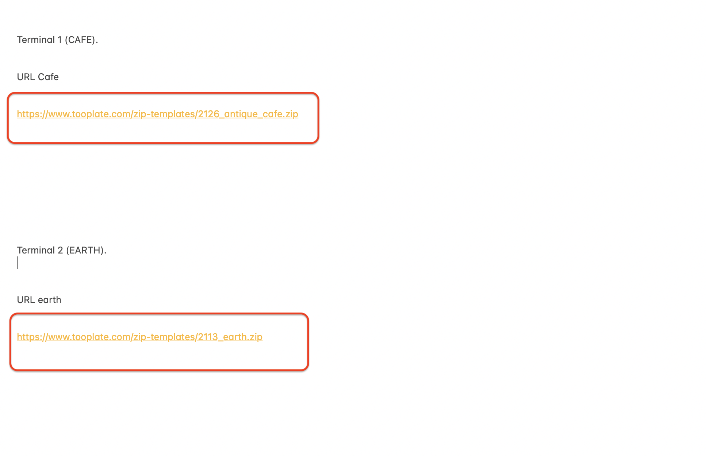
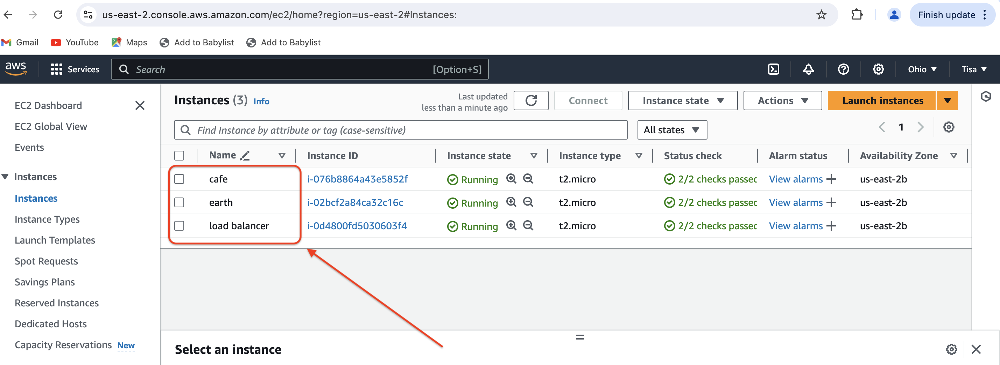
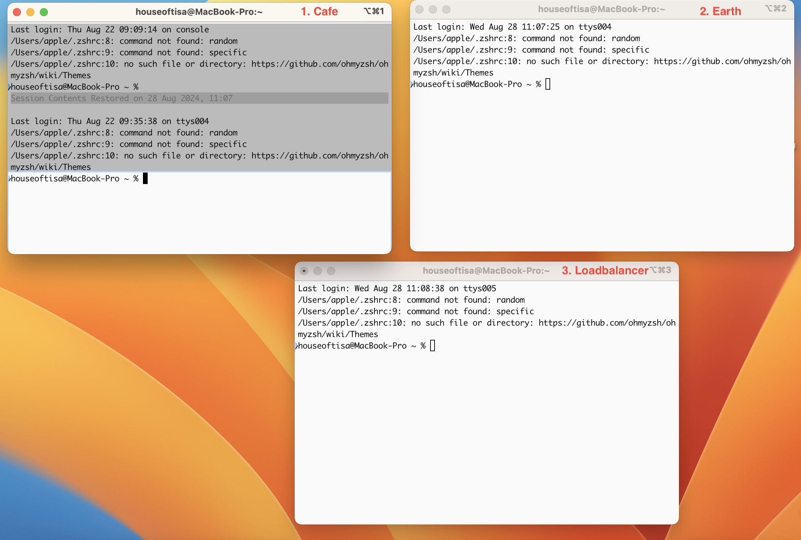
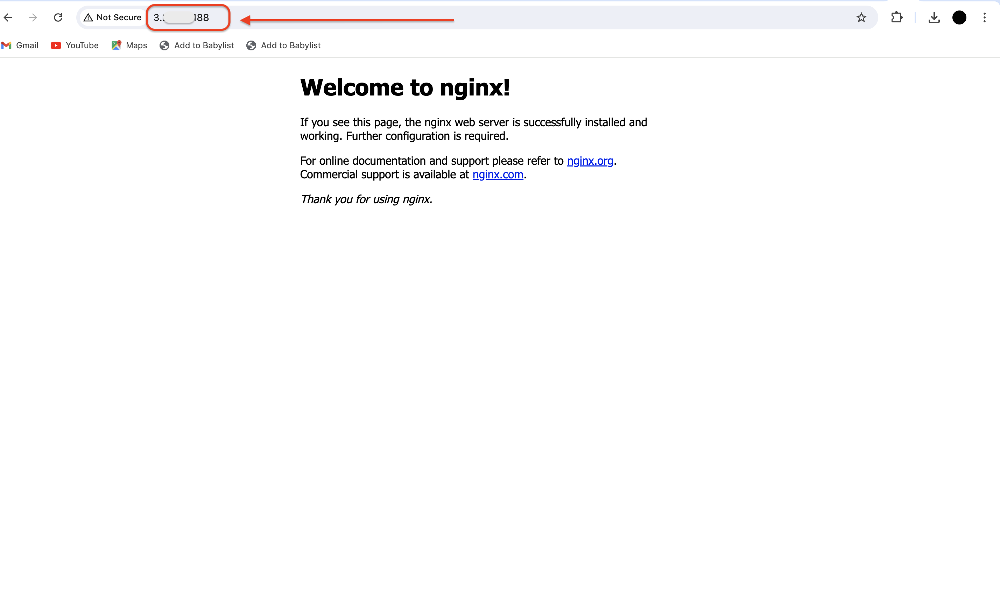
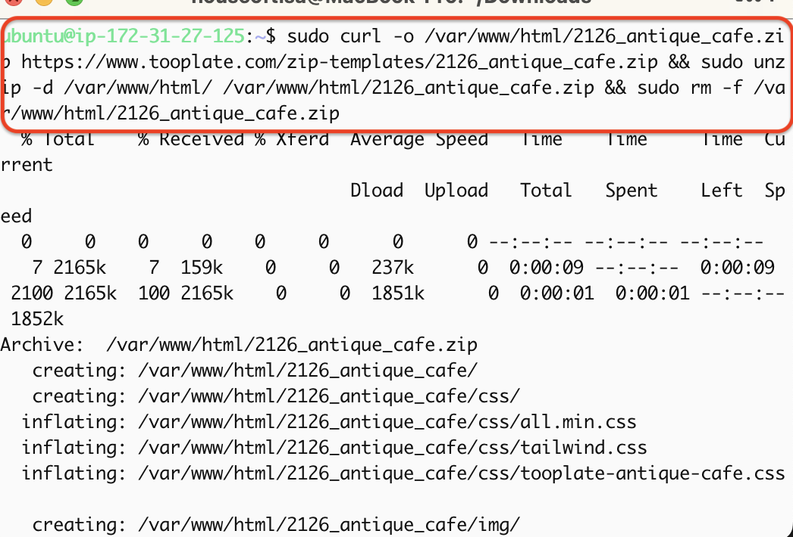
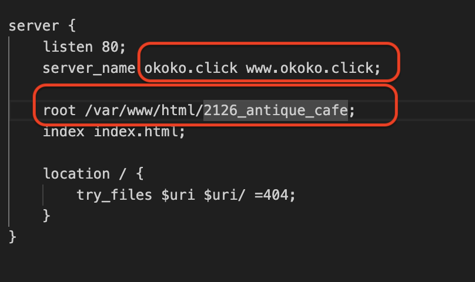
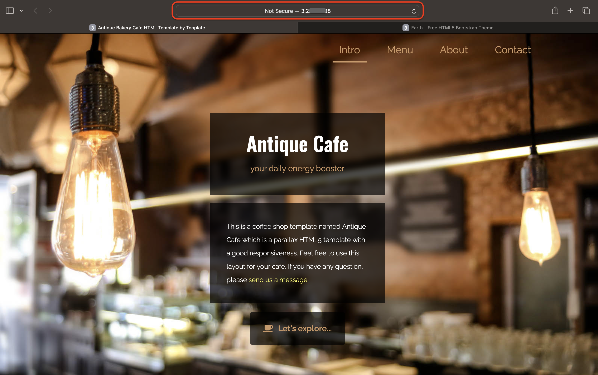
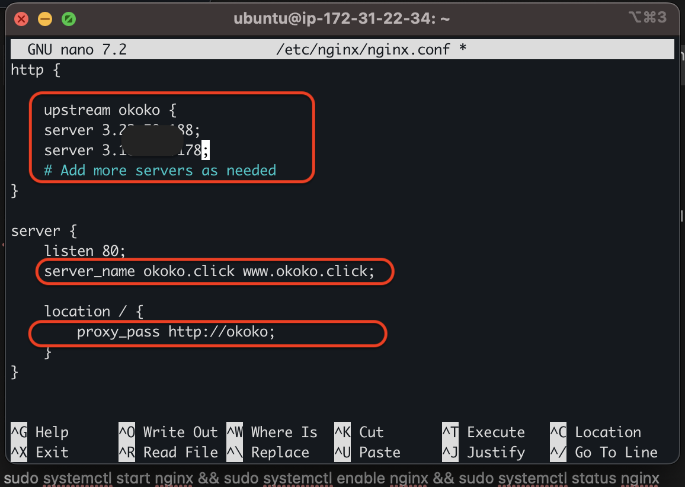

# SETTING UP LOAD BALANCING FOR STATIC WEBSITES USING NGINX

## In this project we will be setting up a load balancer using Nginx between two static websites. This aims to alternate or distribute traffic between the two static websites and ensuring that no single server gets overwhelmed;

* CREATE TWO WEBSITE DIRECTORIES WITH TWO DIFFERENT WEBSITE TEMPLATES

* SPIN UP THREE UBUNTU AWS WEBSERVERS ***THREE EC2 INSTANCES AND ASSOCIATE ELASTIC IP RESPECTIVELY***

* OPEN UP THREE TERMINALS - SSH INTO THE THREE SERVERS - INSTALL NGINX ON ALL THREE SERVERS

* SET UP STATIC WEBSITES ON TWO SERVERS USING NGINX

* CONFIGURE NGINX ON THE THIRD SERVER TO ACT AS THE LOAD BALANCER BETWEEEN THE TWO STATIC WEBSITES

* CREATE AN A RECORD WITH THE NGINX LOAD BALANCER IP (AWS ROUTE 53)

* VALIDATE THE DOMAINS SETUP 

* CONFIGURE CERBOT AND REQUEST FOR SSL/TLS CERTIFICATES FOR THE DOMAINS

# DOCUMENTION

### CREATE TWO WEBSITE DIRECTORIES WITH TWO DIFFERENT WEBSITE TEMPLATES

* First thing I did was go to www.tooplate.com, navigated and located the two templates to be used.

*  I downloaded the zip file and also copied the URL and pasted on my notepad.

***NOTE***: Kindly Check https://github.com/tjagz/Devops00/blob/master/projectA.md for guidance.

* URL 1 : cafe

* URL 2 : earth

### OPEN UP THREE TERMINALS - SSH INTO THE THREE SERVERS - INSTALL NGINX ON ALL THREE SERVERS

* I logged into my aws console, launched three(3) Ec2 instances and associated Elastic ip to each instance. So one instance to one elastic ip (so I created 3 instances and 3 Elastic ips)

***NOTE***: Kindly Check https://github.com/tjagz/Devops00/blob/master/projectA.md for a better understanding, this will guide you on how to launch an instance and associating an elastic ip.

***WHILE CREATING MY INSTANCES I NAME TAGGED THEM ACCORDING TO THE URL I DOWNLOADED SO HAS TO KNOW WHICH IS FOR WHICH AND NOT GET CONFUSED***

* Instacne 1 : cafe
* Instance 2 : earth
* Instance 3 : loadbalancer

* Opened my terminal, then created two more terminals by clicking on new window. 

* on my three terminals I ssh into the servers. Using one instance to one terminal (3 instances to 3 termainals)

* Ran these commands on all 3 terminals;

- ***sudo apt update**

- ***sudo apt upgrade***

- ***sudo apt install nginx***

- ***sudo systemctl start nginx***

- ***sudo systemctl enable nginx***

- ***sudo systemctl status nginx***

* Only ran this command on the two terminals (Instance cafe and instance earth)where I would be downloading the two URL zip files (cafe and earth)

- ***sudo apt install unzip*** (This is to unzip the URL files)

* I pasted the Ip addresses in my brower to confirm the default Nginx start up page.

***TERMINAL SERVER 1 (CAFE)*** 

* I ran the sudo curl, unzip and remove commands together to download and unzip the website files;

***sudo curl -o /var/www/html/2126_antique_cafe.zip https://www.tooplate.com/zip-templates/2126_antique_cafe.zip && sudo unzip -d /var/www/html/ /var/www/html/2126_antique_cafe.zip && sudo rm -f /var/www/html/2126_antique_cafe.zip***

***NOTE***: Before running this command make sure you edit to your downloaded URL zip files.

* I did same for the second terminal server. 

***TERMINAL SERVER 2 (EARTH)***

* I ran the sudo curl, unzip and remove commands together to donload and unzip the website files;

***sudo curl -o /var/www/html/2113_earth.zip https://www.tooplate.com/zip-templates/2113_earth.zip && sudo unzip -d /var/www/html/ /var/www/html/2113_earth.zip && sudo rm -f /var/www/html/2113_earth.zip***

***NOTE***: Before running this command make sure you edit to your downloaded URL zip files.

* In terminal server 1(Cafe) and 2(Earth)

* I set up the website's configuration, by creating a new file in the Nginx sites-avalable directory.

* I ran this command to create and open a blank file in a text editor:

* TERMINAL SERVER 1 (CAFE)

- ***sudo nano /etc/nginx/sites-available/cafe***

* TERMINAL SERVER 2 (EARTH)

- ***sudo nano /etc/nginx/sites-available/earth***

* Copied and pasted the following code into the open text editors for both servers Terminal 1 and Terminal 2:

<pre><code>

server {
    listen 80;
    server_name placeholder.com www.placeholder.com;

    root /var/www/html/placeholder.com;
    index index.html;

    location / {
        try_files $uri $uri/ =404;
    }
}

</code></pre>

* I edited the server name and the root directive withnin the server block to point to the directory where my downloaded website contents are stored in both terminals 1 and 2.

* Look at how I edited mine

* Created a symbolic link for both websites by running these commands:

* TERMINAL SERVER 1 (CAFE)

- ***sudo ln -s /etc/nginx/sites-available/cafe /etc/nginx/sites-enabled/***

- ***sudo rm /etc/nginx/sites-enabled/default***

* TERMINAL SERVER 2 (EARTH)

- ***sudo ln -s /etc/nginx/sites-available/earth /etc/nginx/sites-enabled/***

- - ***sudo rm /etc/nginx/sites-enabled/default***

* Executed the following commands on both terminals 1 and 2:

- ***sudo nginx -t***

- ***sudo systemctl restart nginx***

* Checked both IP addresses to confirm my websites are up and running.

 * IP address pasted on brower for Cafe

* IP addreee pasted for Earth

### CONFIGURE NGINX ON THE THIRD SERVER TO ACT AS THE LOAD BALANCER BETWEEEN THE TWO STATIC WEBSITES

* Remember we installed Nginx on all Three servers...

- On TERMINAL SERVER 3 (LOADBALANCER)

 * Confirmed the Nginx is running by executing this command:

 - ***sudo systemctl status nginx***

 * To edit the Nginx configuration file to setup for load balancing, I ran the command below:

-  ***sudo nano /etc/nginx/nginx.conf***

* I updated the Http block with the following;

<pre><code>

    upstream your domain name {
    server IP address1;
    server IP address2;
    # Add more servers as needed
}

server {
    listen 80;
    server_name <your domain> www.<your domain>;

    location / {
        proxy_pass http://your domain name;
    }
}

</code></pre>

* Edited the IP address/main and subdomains/domain to mine.

* IP addresss 1 : for Cafe

* IP address 2 : for Earth

* Main domain : okoko.click

* Sub-domain : www.okoko.click

* Domain name : okoko

* Checked for syntax errors by executing this command on the loadbalancer terminal:

- ***sudo nginx -t***

* Applied changes by restarting Nginx:

- ***sudo systemctl restart nginx***

### CREATE AN A RECORD WITH THE NGINX LOAD BALANCER IP (AWS ROUTE 53)

* I made my websites accessible via the domain name rather than the IP address. Kindly refer to https://github.com/tjagz/Devops00/blob/master/projectA.md for guidance on how to create an A record with AWS Route 53.

I used the domain bought from www.namecheap.com;

* ***www.okoko.click***

* Pointed my domains's DNS to the IP address of my ***NGINX LOADBALANCER SERVER***. I used the Loadbalancer public IP address to setup the DNS record for the main and subdomain(okoko.click and www.okoko.click) hosted on AWS Route 53

### VALIDATE THE DOMAINS SETUP 

- Pasted my domain name in a web browser to verfify website's accessibility.

- Reloaded the webpage to ensure the load balancer distributed traffic evenly between both servers.

***CAFE AND EARTH WEBPAGES***

### CONFIGURE CERBOT AND REQUEST FOR SSL/TLS CERTIFICATES FOR THE DOMAIN

- Executed the following commands to install certbot and request for certificates;

- ***sudo apt install python3-certbot-nginx***

- ***sudo cerbot --nginx***

- ***sudo certbot renew --dry-run*** (This is for certificate renewal. Its mandatory to renew at least every two months)

* Acess webisite to very that Certbot has successfully enabled HTTPS

## Short video showing both webpages when browser is reloaded

<video width="600" controls>
  <source src="img2/7.mp4" type="video/mp4">
  Your browser does not support the video tag.
</video>

[Download or view the video](https://github.com/tjagz/Dev0ps/raw/master/img2/7.mp4)

# THE END OF PROJECT 3

