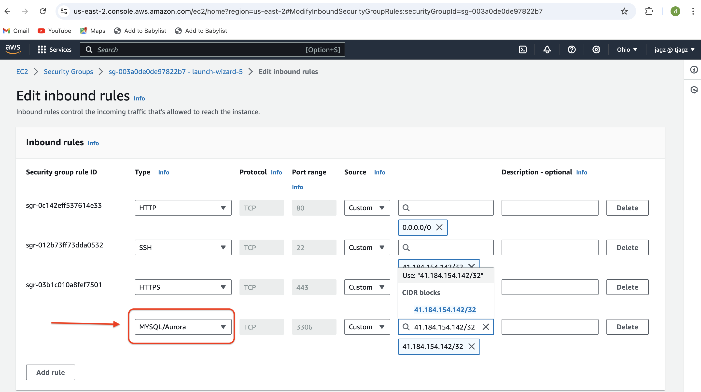
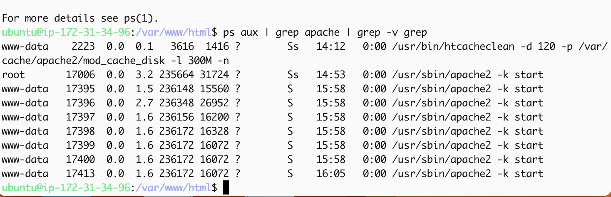

# SETTING UP A WORDPRESS WEBSITE USING LAMP STACK

## Setting up a WordPress website using the LAMP(linux, Apache, Mysql & Php) stack involves several steps, from preparing my server environment to configuring WordPress for optimal performance. Here’s a detailed, step-by-step guide:

* Launched an AWS EC2 Instance

* Connected to my Instance via SSH

* Installed LAMP Stack

* Configured MySQL for Remote Access

* Downloaded and Installed WordPress

* Configured WordPress

* Completed WordPress Installation via Web Interface

* Secured and Optimized My WordPress Site

## Launched an AWS EC2 Instance

* Logged in to AWS Management Console:

* Navigated within AWS Management Console.

* Went to the EC2 Dashboard and clicked Launch Instance.

***NOTE***: Kindly Check https://github.com/tjagz/Devops00/blob/master/projectA.md for a better understanding, this will guide you on how to launch an instance and associate an elastic ip.

* Configured the Instance security group by setting the inbound rule for MYSQL. I clicked on security and I selected the securuty group

* Clicked on the Edit inbound rules

* I clicked Add rule

* Clicked  ***CUSTOM TCP*** and selected ***MYSQL/Aurora

* Entered my Ip address I allowed for access and I clicked Save rules

***Note***: For added security, restricted MySQL access to Server’s IP address. In the Inbound Rule configuration, specified the source as /32

## Connected to my Instance via SSH

## Installed LAMP Stack

* Updated the package list with the following commands;

***sudo apt update && sudo apt upgrade***

* Installed Apache:

 ***sudo apt apache2***

 
 * Started and Enabled Apache:

 ***sudo systemctl enable apache2***
 ***sudo systemctl status apache2***

 * Checked if my server is accessible both locally and from the internet with this command:

 ***curl http://localhost:80***

* Copied my public IPV4 address and pasted on my web browser to confirm if my installation was successful.

## Configured MySQL for Remote Access

* Install MYSQL:

***sudo apt install mysql-server*** and followed the prompts.

* Logged in to the MySQL console;

***sudo mysql*** and set my password for the root user with the MYSQL native password authentication method:

***ALTER USER 'root'@'localhost' IDENTIFIED WITH mysql_native_password BY 'power';***. 

* Exited the MySQL shell by typing exit.

* Secured MYSQL installation:

***sudo mysql_secure_installation***

* I followed the prompts and didnt enable anything so i just used any other key during the installation.

* I also didn't pick the hightest level of password validation policy.

***NOTE***: I set my level policy to ***0*** 

* Enabled MySQL to start on boot:

***sudo systemctl enable mysql***

***sudo systemctl status mysql***

* Installed PHP and confirmed the version:

***sudo apt install php-curl php-gd php-mbstring php-xml php-xmlrpc php-soap php-intl php-zip***

***sudo apt install php libapache2-mod-php php-mysql***

***php -v***

## Created A Virtual Host for my Website Using Apache:

***Note***: I named my directory lamp. You can decide to use any name you like. The command ***mkdir*** is to create a directory/folder.

* Created the directory called ***lamp*** :

***sudo mkdir /var/www/lamp***

* Assigned ownership of directory:

***sudo chown -R $USER:$USER /var/www/lamp***

* Created and opened a new configuration file in Apache's sites-available directory using my preferred command-line editor:

***Note***: I prefer to use the ***nano*** command as my text editor but you can decide to use the ***vi*** or ***vim***.

 ***sudo nano /etc/apache2/sites-available/lamp.conf***

 * Copied and pasted the text below into the blank file;

 ***NOTE***: I edited to the name of my directory ***lamp***

 <pre><code>

<VirtualHost *:80>

ServerName lamp

ServerAlias www.lamp

ServerAdmin webmaster@localhost

DocumentRoot /var/www/lamp

ErrorLog ${APACHE_LOG_DIR}/error.log

CustomLog ${APACHE_LOG_DIR}/access.log combined

</VirtualHost>

</code></pre>

* Saved changes by pressing control X, Y and enter.

* To list the new file in the sites-available directory, I executed this command;

***sudo ls /etc/apache2/sites-available***

* Enabled the new virtual host, using the a2ensite command:

***sudo a2ensite lamp***

* To disable Apache's default website, used the a2dissite command: 

***sudo a2dissite 000-default***

* Checked for syntax error:

***sudo apache2ctl configtest***

* Reloaded apache for the changes to take effect:

***sudo systemctl reload apache2***

***NOTE***: Our new website is now active, but the web root /var/www/lamp is still empty. So I created an index.html file in that location to test that the virtual host works as expected.

* Creted the index file with the content ***"Hello Lamp from jagz, we have so much to do together"*** in the /var/www/lamp directory;

* ***sudo echo 'Hello Lamp,we will be doing so much together from jagz' > /var/www/lamp/index.html***

* Accessed the website with my IP addresss:80 pasted on my browser;

* ***http://public-ip-address:80***

* Then removed the index.html file :

* ***sudo rm /var/www/lamp/index.html***

## Enabled PHP on the website

* Edited the dir.conf file using a text editor: 

* ***sudo nano /etc/apache2/mods-enabled/dir.conf***

* Searched for the DirectoryIndex directive within this file. Which looked like this:

<pre><code>

<IfModule mod_dir.c>
    DirectoryIndex index.html index.cgi index.pl index.php index.xhtml index.htm
</IfModule> 

</code></pre>

* Prioritized index.php over index.html i.e moved index.php to the beginning of the list.

* ***Check below***

<pre><code>

<IfModule mod_dir.c>
    DirectoryIndex index.php index.html index.cgi index.pl index.xhtml index.htm
</IfModule>

</code></pre>

* Saved and exited with: Control X, Y and enter.

* Reload Apache to effect changes:

* ***sudo systemctl reload apache2***

* Created a new file named index.php inside my custom web root folder (/var/wwwlamp), used the following command to open it in the nano text editor:

* ***sudo nano /var/www/lamp/index.php***

* This created a new file. Copied and pasted the following PHP code into the new file, saved and closed file :

<pre><code>

<?php

phpinfo();

</code></pre>

* Went to my browser, refreshed my ip address page and confirmed the PHP;

## Downloaded and Installed WordPress

* Navigated into the default webserver root directory /var/www/html with the ***cd*** command;

* ***cd /var/www/html***

* Downloaded the wordPress installation files;

* ***sudo wget -c http://wordpress.org/latest.tar.gz***

* Extracted the files from the downloaded Wordpress archive;

* ***sudo tar -xzvf latest.tar.gz***

* Confirmed existence of the wordpress directory in the current location with the command below:

* ***ls -l***

* Checked the user running the webserver with the command :

* ***ps aux | grep apache | grep -v grep***

* Granted ownership of the Wordpress directory and its files to the webserver user(www-data):

* ***sudo chown -R www-data:www-data /var/www/html/wordpress***

### Created a database for Wordpress

* Acessed my MySQL root account;

* ***sudo myseql -u root -p*** and I entered the password I set earlier(I used ***power***)

* Created a separate database named wp_db for WordPress to manage, executed the following command in the MySQL prompt: CREATE DATABASE wp_db;

* ***NOTE***: This command allowed me to create a new database (wp_db) within my MySQL environment. You can name whatever you like.

* Accessed the new database, I created  MySQL user account with a strong password using the following command: CREATE USER jagz@localhost IDENTIFIED BY 'wp-password';

* Replacec 'wp-password' with my preferred strong password(power-ful) for the MySQL user account.

* Granted all privileges to the created user (jagz@localhost):

<pre><code>

GRANT ALL PRIVILEGES ON wp_db.* TO jagz*localhost;
FLUSH PRIVILEGES;

</code></pre>

* Typed exit, to exit the MySQL shell. 

* Granted executable permissions recursively (-R) to the wordpress folder:

* ***sudo chmod -R 777 wordpress/***

***NOTE***: This command sets read (r), write (w), and execute (x) permissions for the owner, group, and others on all files and directories within the wordpress folder.

* Changed directory to the WordPress directory by running the command: 

* ***cd wordpress***

## Configured WordPress

* Renamed the sample WordPress configuration file with the command: 

* ***mv wp-config-sample.php wp-config.php***

* Edited the wp-config.php file using the command: 

* ***sudo nano wp-config.php***

* Updated the database settings in the wp-config.php file by replacing placeholders like database_name_here, username_here, and password_here with my actual database details.

* Modified the configuration file lamp.conf by updating the document root to the directory where my WordPress installation is located: 

* ***sudo nano /etc/apache2/sites-available/lamp.conf*** 

* After updating the document root to /var/www/html directory in my editor, I saved the changes and exited.

* Reloaded Apache for the changes to take effect: 

* ***sudo systemctl reload apache2***

## Completed WordPress Installation via Web Interface

* I accessed my WordPress page to complete the installation. Opened my web browser and pasted to http://IP Address/wordpress/. This took me to the WordPress setup wizard where I finalized the installation process.

* Selected my preffered language and then clicked Continue.

* Filled all required information and clicked Install WordPress. 

* Entered my username and password,clicked log in to access my WordPress admin dasboard

## Created An A Record

***NOTE***: Kindly Check https://github.com/tjagz/Devops00/blob/master/projectA.md for a better understanding on how to create an A record using ***Route 53**.

* Then I updated my Apache configuration file in the sites-available directory to point to my domain name:

*  ***sudo nano /etc/apache2/sites-available/lamp.conf***

* ***BEFORE***

* Ensured that the server settings in my Apache configuration points to my domain name(okoko.click), and that the document root accurately points to my WordPress directory. I made these adjustments, saved the changes and exited the editor.

<pre><code>

<VirtualHost *:80>
    ServerName <Your root domain name>
    ServerAlias <Your sub domain name>
    ServerAdmin webmaster@<Your root domain name>

    DocumentRoot /var/www/html/wordpress

    <Directory /var/www/html/wordpress>
        Options Indexes FollowSymLinks
       # AllowOverride All
        Require all granted
    </Directory>

    ErrorLog ${APACHE_LOG_DIR}/error.log
    CustomLog ${APACHE_LOG_DIR}/access.log combined
</VirtualHost>

</code</pre>>

* ***AFTER***

* Updated my wp-config.php file with DNS settings, used the following command: 

* ***sudo nano wp-config.php***

* Added these lines to the file:

<pre><code>

/** MY DNS SETTINGS */
define('WP_HOME', 'http://<domain name>');

define('WP_SITEURL', 'http://<domain name>');

</code></pre>

* Replaced http://<domain name> with my actual domain name(okoko.click). Saved the changes and exited the editor.

* Reloaded my Apache server to apply the changes with the command: 

* ***sudo systemctl reload apache2***

* Visited my website okoko.click to view my Wordpress site.

* To log in to my WordPress admin portal, visited http://okoko.click/wp-admin, Entered my username and password, then clicked on log In.

## Secured and Optimized my WordPress Site

* Installed certbot and Requested For SSL/TLS Certificate with the folllowing commands:

* ***sudo apt update***

* ***sudo apt install certbot python3-certbot-apache***

* ***sudo certbot --apache***

* Visited my website to confirm that the "not secure" warning no longer appears, indicating that my website is now secured with HTTPS.

# THE END OF PROJECT 4