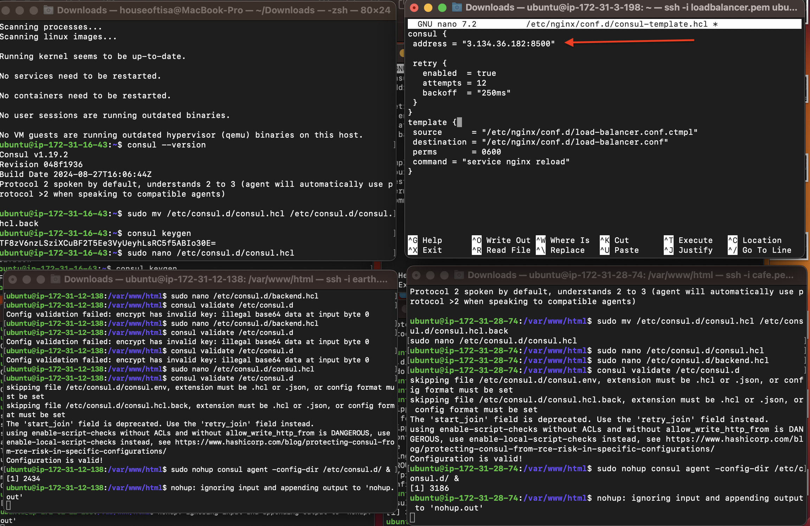

# SETTING UP SERVICE DISCOVERY USING NGINX & CONSUL

### Setting up service discovery with NGINX and Consul streamlines service management, enhances load balancing and fault tolerance, and supports dynamic and efficient scaling in modern IT environments. This integration simplifies the operational complexity associated with maintaining and updating services, leading to a more resilient and responsive infrastructure. Here's adetailed step by step guide:

- Launched AWS EC2 Instances

- Configured Security Groups

- Setup Consul Server

- Setup Backend Servers

- Setup Load-Balancer

- Validated Service Discovery Setup

# DOCUMENTATION

## Launched AWS EC2 Instances

- Logged in to AWS Management Console:

- Navigated within AWS Management Console.

- Went to the EC2 Dashboard and clicked Launch Instance.

***NOTE***: Kindly Check https://github.com/tjagz/Devops00/blob/master/projectA.md for a better understanding, this will guide you on how to launch an instance and associate an elastic ip.

* Created four instances to be used and tagged them as what I'd be using them for:

1. Backend(cafe) : Backend server 1
2. Loadbalancer : Load-balancer
3. Backend(earth) : Backend server 2
4. Consul : Consul server

* This is to avoid mistakes and for easy identification.

## Configured Security Groups

- Clicked on Consul instance

- Clicked on security

- Clicked on the security group

- Clicked on edit inbound rules

- Clicked on add rules

- Added inbound rules for the Consul Server Security group by clicking on custom:

- Used the table below to update my Consul Server Security group inbound rules :

| **S/N** | **PORTNAME**   | **PROTOCOL** | **DEFAULT PORT** |
|---------|----------------|--------------|------------------|
| **1**   | **DNS**        | **TCP**      | **8600**         |
| **2**   | **DNS**        | **UDP**      | **8600**         |
| **3**   | **HTTP API**   | **TCP**      | **8500**         |
| **4**   | **HTTPS API**  | **TCP**      | **8501**         |
| **5**   | **gRPC**       | **TCP**      | **8502**         |
| **6**   | **gRPC TLS**   | **TCP**      | **8503**         |
| **7**   | **Server RPC** | **TCP**      | **8300**         |
| **8**   | **LAN serf**   | **TCP**      | **8301**         |
| **9**   | **WAN Serf**   | **TCP**      | **8302**         |
| **10**  | **LAN Serf**   | **UDP**      | **8301**         |
| **11**  | **WAN Serf**   | **UDP**      | **8302**         |

- Updated and verified Consul server security group rules and clicked on save;

## Setup Consul Server

- Navigated to my Comnsul instance SSh key  and copied it

- Created four terminals for this project and highlished the terminal for my Consul server

- SSH into my Consul Server

- Visited consol.io, navigated to downloads for linux and copied and pasted the installation command in my consul terminal.

<pre><code>

wget -O- https://apt.releases.hashicorp.com/gpg | gpg --dearmor | sudo tee /usr/share/keyrings/hashicorp-archive-keyring.gpg

echo "deb [signed-by=/usr/share/keyrings/hashicorp-archive-keyring.gpg] https://apt.releases.hashicorp.com $(lsb_release -cs) main" | sudo tee /etc/apt/sources.list.d/hashicorp.list

sudo apt update && sudo apt install consul

</code></pre>

- Confirmed Consul installation by chekcing the Consul version;

- ***consul --version***

- Configured the Consul server, by backing up the default configuration file consul.hcl and renaming it to consul.hcl.back. Using the following command: 

- ***sudo mv /etc/consul.d/consul.hcl /etc/consul.d/consul.hcl.back***

- Generated an encryted key with this command:

- ***consul keygen***

- Copied the generated encrypted key and pasted on my notepad;

- Created a new file named consul.hcl in the /etc/consul.d directory, using the following command: 

- ***sudo nano /etc/consul.d/consul.hcl***

- Copied and pasted the below texts into the Consul.hcl file and replaced <***THE_ENCRYPTED_KEY***> with my generated encryted key:

<pre><code>

"bind_addr" = "0.0.0.0"
"client_addr" = "0.0.0.0"
"data_dir" = "/var/consul"
"encrypt" = "<THE_ENCRYPTED_KEY>"
"datacenter" = "dc1"
"ui" = true
"server" = true
"log_level" = "INFO"

</code></pre>

- ***UPDATED***

- Saved the file after adding the contect; Control X, Y and enter.

- Started the Consul server in the background by executing this command;

- ***sudo nohup consul agent -dev -config-dir /etc/consul.d/ &***

- Checked the consul member with this command:

- ***consul members***

- Visited my Consul's public EC2 IP address with :8500 (***EC2 Consul Server IP address:8500***), to access the Consul's dashboard.

## Setup Backend Servers

- Managed our Nginx backend servers more easily by using service discovery. To do this, I installed Nginx and the Consul agent on the two backend servers(***Backend(Earth) and Backend(cafe)***). The Consul agent acts like a messenger, automatically registering both the server and the Nginx service running on it with the Consul server, which acts like a central directory.

-  I SSH into the backend servers and executed this commands to update and install Nginx;

- ***sudo apt-get update -y***

- ***sudo apt install nginx -y***

- ***NOTE***: After installing Nginx, navigated to the default HTML directory and modified the index.html file on both servers to differentiate them.

- Changed directory to the HTML directory;

- ***cd /var/www/html***

- Opened the HTML file with my preferred text editor to make edits: 

- ***sudo nano index.html***

- Copied the HTML content below into the index.html file. On the second server, replacd SERVER-01 with SERVER-02 in the HTML file to differentiate between the two backend servers. ***NOTE***: You can change the title to any title of your choice but i left mine as ***Kanekis Backend Sever***

<pre><code>&lt;!DOCTYPE html&gt;
&lt;html&gt;
&lt;head&gt;
    &lt;title&gt;Kanekis Backend Server&lt;/title&gt;
&lt;/head&gt;
&lt;body&gt;
    &lt;h1&gt;This is Backend SERVER-01&lt;/h1&gt;
&lt;/body&gt;
&lt;/html&gt;
</code></pre>

- Saved and exited 

- Installed Consul as an agent on the two servers. Executed the following commands to install Consul:

<pre><code>

wget -O- https://apt.releases.hashicorp.com/gpg | gpg --dearmor | sudo tee /usr/share/keyrings/hashicorp-archive-keyring.gpg

echo "deb [signed-by=/usr/share/keyrings/hashicorp-archive-keyring.gpg] https://apt.releases.hashicorp.com $(lsb_release -cs) main" | sudo tee /etc/apt/sources.list.d/hashicorp.list

sudo apt update && sudo apt install consul

</code></pre>

- Verified that Consul is installed properly with the following command: 

- ***consul --version***

- Replaced the default Consul configuration file config.hcl located in /etc/consul.d with my custom consul.hcl file.

- Renamed the default file and created a new one by running the following commands:

<pre><code>

sudo mv /etc/consul.d/consul.hcl /etc/consul.d/consul.hcl.back
sudo nano /etc/consul.d/consul.hcl

</code></pre>

- Added the following contents to the file. Replaced <THE_ENCRYPTED_KEY> with your encryption key. Also, replaced XX.XXX.XX.XX with my Consul server's IP address.

<pre><code>

"server" = false
"datacenter" = "dc1"
"data_dir" = "/var/consul"
"encrypt" = "<THE_ENCRYPTED_KEY>"
"log_level" = "INFO"
"enable_script_checks" = true
"enable_syslog" = true
"leave_on_terminate" = true
"start_join" = ["XX.XXX.XX.XX"]

</code></pre>

- Created a backend.hcl configuration file in the /etc/consul.d directory to register the Nginx service and its health check URLs with the Consul server. This enabled the Consul server to continuously monitor the health of the Nginx service. Used the following command to create and edit the file: 

- ***sudo nano /etc/consul.d/backend.hcl***

- Added the following contents to the backend.hcl file and saved it.

<pre><code>

"service" = {
  "Name" = "backend"
  "Port" = 80
  "check" = {
    "args" = ["curl", "localhost"]
    "interval" = "3s"
  }
}

</code></pre>

- This configuration registers the backend servers with the Consul server and sets up a health check that uses curl to test the service every 3 seconds.

- Verified the configurations by executing the following command: 

- ***consul validate /etc/consul.d***

- After confirming all configurations. Started the Consul agent with the following command: 

- ***sudo nohup consul agent -config-dir /etc/consul.d/ &***

- Verified if everything is working perfectly, visited my Consul User Interface. To see the backend listed in the UI as depicted below, it indicated that the backend has successfully registered itself with Consul.

<video width="600" controls>
  <source src="videos/27.0.mp4" type="video/mp4">
  Your browser does not support the video tag.
</video>

## Setup Load-Balancer

- SSh into the load-balancer server. Updated the package information and installed unzip with the following commands:

<pre><code>

sudo apt-get update -y
sudo apt-get install unzip -y

</code></pre>

- Installed Nginx using the following command: 

- ***sudo apt install nginx -y***

- Downloaded the consul-template binary using the following command:

<pre><code>

sudo curl -L  https://releases.hashicorp.com/consul-template/0.30.0/consul-template_0.30.0_linux_amd64.zip -o /opt/consul-template.zip

sudo unzip /opt/consul-template.zip -d  /usr/local/bin/

</code></pre>

- Verified the installation of consul-template, checked its version with the following command: 

- ***consul-template --version***

- Created and edited a file named load-balancer.conf.ctmpl in the /etc/nginx/conf.d directory, using the following command: 

- ***sudo nano /etc/nginx/conf.d/load-balancer.conf.ctmpl***

- Copied and pasted the following content into the file:

<pre><code>

upstream backend {
 {{- range service "backend" }} 
  server {{ .Address }}:{{ .Port }}; 
 {{- end }} 
}

server {
   listen 80;

   location / {
      proxy_pass http://backend;
   }
}

</code></pre>

- ***NOTE***: This setup keeps Nginx's backend server list in sync with Consul's. It ensures that Nginx always routes traffic to the currently available backend servers.

- Created a file named consul-template.hcl in the /etc/nginx/conf.d/ directory. This configuration file is used by consul-template to specify details about the Consul server IP and the destination path where the processed load-balancer.conf file will be saved.

- Executed this command to create and edit the file:

- ***sudo nano /etc/nginx/conf.d/consul-template.hcl***

- Added the following content to the file, replacing <Consul Server IP> with my Consul server's IP address

<pre><code>

consul {
 address = "<Consul Server IP>:8500"

 retry {
   enabled  = true
   attempts = 12
   backoff  = "250ms"
 }
}
template {
 source      = "/etc/nginx/conf.d/load-balancer.conf.ctmpl"
 destination = "/etc/nginx/conf.d/load-balancer.conf"
 perms       = 0600
 command = "service nginx reload"
}

</code></pre>

- Deleted the default server configuration to disable it by running the following command: 

- ***sudo rm /etc/nginx/sites-enabled/default***

- Restarted Nginx to apply the changes by running the following command: 

- ***sudo systemctl restart nginx***

- Once configurations were completed, started the Consul Template agent using the following command. This continuously monitors Consul for changes;

<pre><code>

sudo nohup consul-template -config=/etc/nginx/conf.d/consul-template.hcl &

</code></pre>

- Once pasted, press enter. It will bring out a prompt, complete by typing;

- ***sudo cat /etc/nginx/conf.d/load-balancer.conf***

- This command showed me the contents of the load-balancer.conf file located in the /etc/nginx/conf.d/ directory. This allowed me to review Nignx load balancer configuration without editing the file.

- Accessed the load balancer IP address in my web browser, it displayed the custom HTML content from one of the backend servers. When I refreshed the page, the load balancer routed my request to the other backend server, displaying its custom HTML content.

## Validated Service Discovery Setup

- I tested the configuration by observing what happens when one of the backend servers is stopped.

- The Consul server monitors the health of each registered service. Once a backend server is stopped, Consul will detect the server's unavailability and mark it as unhealthy. The health check for that server will fail, and it will be removed from the load balancer's active pool of servers.

- This resulted to the load balancer only directing traffic to the remaining healthy backend servers. Ensuring my application continues to run smoothly without any disruption to users. This demonstrated the effectiveness of the service discovery and health check configuration with Consul and Nginx.

<video width="600" controls>
  <source src="videos/37.1.mp4" type="video/mp4">
  Your browser does not support the video tag.
</video>

# THE END OF PROJECT 5