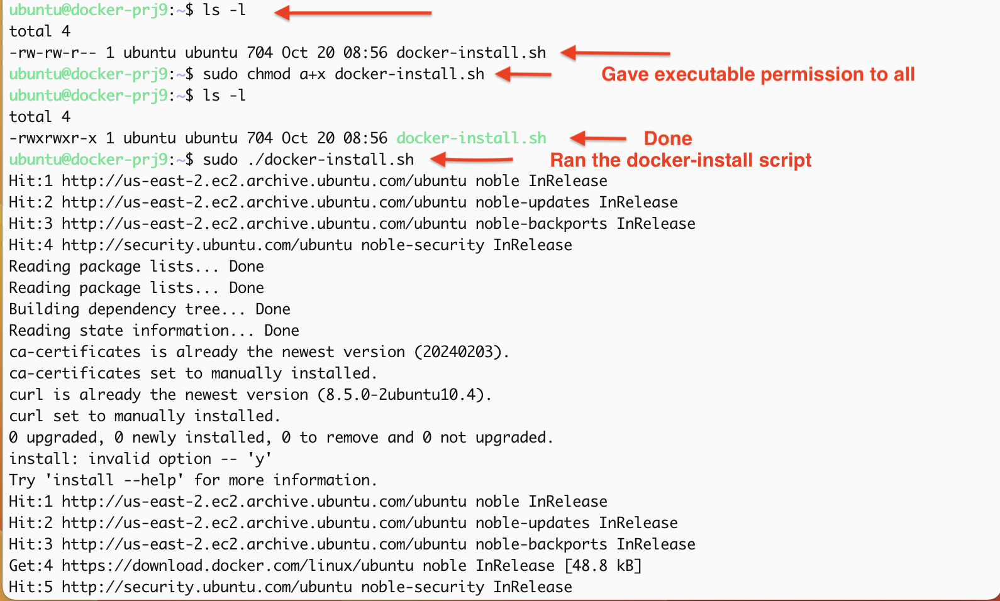
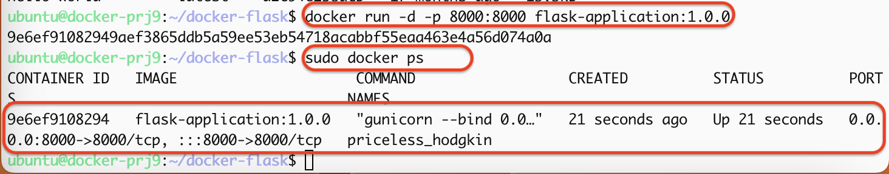

# DOCKER PROJECT

* Docker is an open-source platform designed to automate the deployment, scaling, and management of applications in lightweight, portable containers. Here are the key points:

### Containers:

* Docker containers are lightweight, standalone packages that include everything needed to run an application: code, runtime, libraries, and system tools. They share the host OS kernel but run in isolated environments.

### Images:

- A Docker image is a read-only template used to create containers. Images are built from a Dockerfile, which contains instructions for how to set up the application environment.

### Dockerfile:

- This is a text file with a set of commands and instructions to create a Docker image. It specifies the base image, environment variables, dependencies, and commands to run.

### Portability:

- Docker containers can run on any machine that has Docker installed, ensuring consistency across development, testing, and production environments.

### Isolation:

- Each container operates independently, which helps avoid conflicts between applications and simplifies dependency management.

### Efficiency:

- Containers use system resources more efficiently than traditional virtual machines because they share the host OS, reducing overhead.

### Version Control:

- Docker images can be versioned, making it easy to roll back to previous versions of an application.

### Ecosystem:

- Docker has a rich ecosystem that includes Docker Hub (a repository for sharing images), Docker Compose (for managing multi-container applications), and Docker Swarm/Kubernetes (for orchestrating containers).

### Development and CI/CD:

- Docker simplifies the development workflow and integrates well with continuous integration/continuous deployment (CI/CD) pipelines, enabling rapid testing and deployment of applications.

### Use Cases

- Microservices Architecture: Docker is ideal for deploying microservices, allowing developers to manage individual components independently.
- Dev/Test Environments: Developers can quickly create and share isolated environments for testing applications.
- Cloud Deployment: Docker containers can be easily deployed on various cloud platforms.

### Conclusion
- Docker streamlines application development and deployment, enhances scalability and resource efficiency, and fosters a consistent workflow across different environments. Its ability to encapsulate applications and their dependencies makes it a powerful tool for modern software development practices.

# Dockerfile: Building our First Image

- Provision an instance

- Install and start docker

- Clone a Docker Project

- Run the Docker Application

## Provision an instance

- Created a new security group  

- Added these inbound rules to my new security group

- Added nametag and description

| TYPE   | PROTOCOL | PORT RANGE | SOURCE   |   |
|--------|----------|------------|----------|---|
| SSH    | TCP      | 22         | ANYWHERE |   |
| HTTP   | TCP      | 80         | ANYWHERE |   |
| HTTPS  | TCP      | 443        | ANYWHERE |   |
| CUSTOM | TCP      | 8000       | ANYWHERE |   |

- Launched an instance and this time, I selected exiting security group since i created one for this purpose.

- ssh into my terminal 

- First thing I did was update and upgrade the server

<pre><code>

sudo apt update -y && sudo apt upgrade -y

</code></pre>

## Install and start Docker

- For docker installation I wrote a script from the website: https://docs.docker.com/engine/install/ubuntu/

- Using Step 1 and Step 2

- opened my Vscode and created a script with .sh

- Created a script called docker-install.sh 

- Went to my terminal and used my text editor to create the script and also edit;

<pre><code>

sudo nano docker-install.sh

</code></pre>

- Pasted the below script in the text editor;

<pre><code>

# Add Docker's official GPG key:
sudo apt-get update -y
sudo apt-get install ca-certificates curl -y
sudo install -m 0755 -d /etc/apt/keyrings -y
sudo curl -fsSL https://download.docker.com/linux/ubuntu/gpg -o /etc/apt/keyrings/docker.asc
sudo chmod a+r /etc/apt/keyrings/docker.asc

# Add the repository to Apt sources:
echo \
  "deb [arch=$(dpkg --print-architecture) signed-by=/etc/apt/keyrings/docker.asc] https://download.docker.com/linux/ubuntu \
  $(. /etc/os-release && echo "$VERSION_CODENAME") stable" | \
  sudo tee /etc/apt/sources.list.d/docker.list > /dev/null
sudo apt-get update -y

sudo apt-get install docker-ce docker-ce-cli containerd.io docker-buildx-plugin docker-compose-plugin -y

</code></pre>

- ran  ***ls -l*** command to check the permissions on the script

- Noticed the script had no executable permission for root, group and other

- So I gave executable permission to all by running this command ***chmod a+x docker-install.sh***

- ran this command again to check ***ls -l*** command to check the permissions on the script

- Ran the the script with the below commnad;

<pre><code>

sudo ./docker-install.sh

</code></pre>

- After the installation, Verified that the Docker Engine installation was successful by running the hello-world image.

- ***sudo docker run hello-world***

- ***sudo systemctl enable docker***

- ***sudo systemctl status docker***

- ***Note***: ctrl + c to exit a running docker

## Cloned the Docker Project

- Once Docker was installed and set up, I cloned the project repository.

- Checked if git is installed;

- ***git --version***

- if not installed, install with the command below

<pre><code>

sudo apt install git -y

</code></pre>

- Cloned the project repository and also cd into the docker-flask:

<pre><code>

git clone https://github.com/TobiOlajumoke/docker-flask
cd docker-flask

</code></pre>

- Used the cat command to check the content of the cloned dockerfile;

<pre><code>

cat dockerfile

</code></pre>

## Breaking down the Docker file;

- This Dockerfile is used to create a Docker image for a Python application. Let's break it down step by step:

### ARG PYTHON_VERSION=3.11.6:

This line sets a variable called PYTHON_VERSION, which defines which version of Python to use (in this case, 3.11.6).

### FROM python:${PYTHON_VERSION}-slim as base:

This specifies the base image for our Docker image. It uses the slim version of Python 3.11.6, which is a smaller, more lightweight version.

### ENV PYTHONDONTWRITEBYTECODE=1:

This environment variable prevents Python from writing .pyc files, which are bytecode files. This keeps the image smaller.

### ENV PYTHONUNBUFFERED=1:

This setting makes Python output logs directly to the terminal, which is helpful for debugging.

### WORKDIR /app:

This command sets the working directory inside the Docker container to /app. All subsequent commands will be run in this directory.
ARG UID=10001:

This line defines a user ID variable UID with a default value of 10001.
RUN adduser ...:

This command creates a new user called appuser with the specified UID. This user won't have a password and won’t have a home directory, enhancing security.

### COPY requirements.txt .:

This copies a file named requirements.txt from your local machine into the /app directory in the Docker container. This file usually contains a list of Python packages the application needs.

### RUN python -m pip install -r requirements.txt:

This installs the Python packages listed in requirements.txt using pip.

### USER appuser:

This switches the user from root to appuser. Running applications as a non-root user is a best practice for security.
COPY . .:

This copies all the application files from your local directory to the /app directory in the container.

### EXPOSE 8000:

- This informs Docker that the application will listen for connections on port 8000.

### CMD ["gunicorn", "--bind", "0.0.0.0:8000", "hello
"]:

- This command tells Docker to run the application using Gunicorn (a Python WSGI HTTP server). It binds the server to all network interfaces on port 8000 and specifies that the application can be found in the hello module, in the app variable.

- In summary, this Dockerfile sets up a lightweight Python environment, installs necessary dependencies, creates a secure user, and runs the application. It’s a way to package your app so it can run consistently anywhere.

## Run the Docker Application

- Build the Docker image with command below;

<pre><code>

docker build -t flask-application:1.0.0 .

</code></pre>

- Checked if image was built with command below;

<pre><code>

sudo docker images

</code></pre>

- Ran the Docker container;

<pre><code>

docker run -d -p 8000:8000 flask-application:1.0.0

</code></pre>

- Checked if container is running ;

<pre><code>

sudo docker ps

</code></pre>

- Tested in Browser, Went to my browser and accessed my EC2 public IP to check if the app is running properly:

<pre><code>

http://<my-ec2-public-ip>:8000

</code></pre>

- Successfully deployed the Dockerized Flask app on an AWS EC2 instance. This is a common workflow in modern cloud infrastructure where applications are containerized for ease of deployment, scalability, and management.

# Let's push the image to docker hub

- Pushing Docker Images to Docker Hub

### Created a Docker Hub account

- Went to https://hub.docker.com/

- Signed up for a free account 

- Created a repo

- Went to my terminal used the docker CLI to log in;

<pre><code>

sudo docker login

</code></pre>

- Followed the prompt;

### Tagged the Image 

- Before pushing the image, I had to tag it with my Docker Hub username and my repository name.  
 
- The tagging format is;

<pre><code>

sudo docker tag flask-application:1.0.0 myusername/myreponame:1.0.0

</code></pre>

### Pushed the Image to Docker Hub

<pre><code>

docker push myusername/flask:1.0.0

</code></pre>

- myusername: tisab102
- myreponame: flask

- If you get errors when tagging, try rebooting ur instance with ***sudo reboot***

- ssh back in 

- cd /docker-flask

- check docker status: ***sudo systemctl status docker***

- start docker if off: ***sudo systemctl status docker***

- docker login

- Try again to tag

### Verified the Push

After the push was completed, I verified that my image on Docker Hub by visiting your Docker Hub profile and checking the repositories

